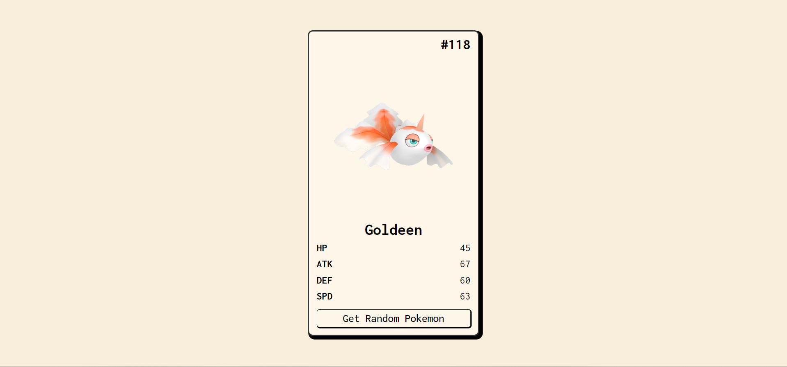

<h1 align="center">Pokemon Random</h1>

  <h3>
    <a href="https://bright-bombolone-ea0d22.netlify.app">
      Demo
    </a>
     | 
    <a href="https://github.com/vidaencodigo/pokemon-random">
      Repo
    </a>
     
  </h3>

## Resumén

Proyecto utiliza la api pokepiv2 para obtener de manera aleatoria de 1 a 151 pokemon.

Utiliza WebComponent nativo con templates y slots, para crear el componente de la tarjeta con la info e imagen del pokemon, para esto se utiliza la libreria axios para hacer la petición GET a la api.

## Contact

  
- GitHub [@vidaencodigo](https://github.com/vidaencodigo)
- Twitter [@emmanuelluur](https://twitter.com/emmanuelluur)